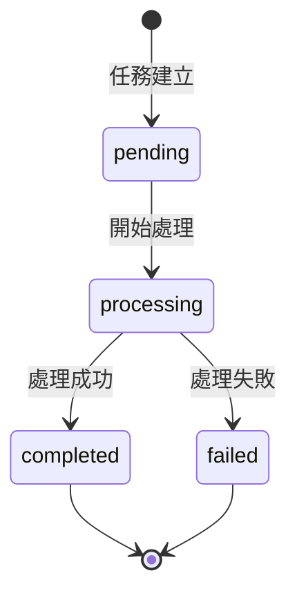

# AutoVideoMaker API Documentation

**Version:** `1.0.0`
**Base URL:** `http://localhost:8000`

---

## 📌 Overview

AutoVideoMaker API 提供自動化簡報影片生成服務。主要功能包含：
- 從 Google Drive 下載素材
- AI 自動生成字幕（Whisper + Claude 3.5 Sonnet）
- 合成 16:9 專業簡報影片（FFmpeg）
- 上傳結果到 Google Drive
- 透過 Webhook 回調通知（Make.com 整合）

---

## 🔐 Authentication (驗證)

> [!NOTE]
> 目前 API **尚未實作驗證機制**，適合內部使用或搭配 API Gateway 保護。

生產環境建議：
- 在前方部署 API Gateway (如 AWS API Gateway, Kong)
- 限制 CORS `allow_origins` 白名單
- 新增 Bearer Token 或 API Key 驗證

---

## 📚 Endpoints

| Endpoint | Method | Description |
|:---------|:-------|:------------|
| `/` | GET | API 根路徑資訊 |
| `/api/health` | GET | 健康檢查 |
| `/api/process-video-online` | POST | 處理 Google Drive 素材 |
| `/api/process-video-local` | POST | 處理本地素材（測試用） |
| `/api/jobs/{job_id}` | GET | 查詢任務狀態 |

---

## 1️⃣ Health Check

檢查 API 服務是否正常運行。

### Endpoint

```
GET /api/health
```

### Headers

| Header | Value | Required |
|:-------|:------|:---------|
| `Accept` | `application/json` | Optional |

### Request Body

無

### Response

**Status Code:** `200 OK`

```json
{
  "status": "ok",
  "version": "1.0.0"
}
```

### Response Fields

| Field | Type | Description |
|:------|:-----|:------------|
| `status` | string | 服務狀態，固定為 `"ok"` |
| `version` | string | API 版本號 |

---

## 2️⃣ Process Video (Google Drive)

處理 Google Drive 上的影片素材，在背景執行處理任務，完成後透過 Webhook 通知。

### Endpoint

```
POST /api/process-video-online
```

### Headers

| Header | Value | Required |
|:-------|:------|:---------|
| `Content-Type` | `application/json` | ✅ Yes |

### Request Body (JSON)

```json
{
  "drive_folder_id": "1abc123def456",
  "callback_url": "https://hook.make.com/xxx",
  "skip_subtitle": false,
  "encoding_preset": "medium"
}
```

### Request Fields

| Field | Type | Required | Default | Description |
|:------|:-----|:---------|:--------|:------------|
| `drive_folder_id` | string | ✅ Yes | — | Google Drive 資料夾 ID |
| `callback_url` | string | ✅ Yes | — | 完成後通知的 Webhook URL |
| `skip_subtitle` | boolean | ❌ No | `false` | 是否跳過字幕生成 |
| `encoding_preset` | string | ❌ No | `"medium"` | 編碼速度選項 (見下方說明) |

#### Encoding Preset 選項

| Value | 速度 | 品質 | 說明 |
|:------|:-----|:-----|:-----|
| `ultrafast` | ⚡⚡⚡ 最快 | ⭐ 最低 | 快速預覽用 |
| `veryfast` | ⚡⚡ 很快 | ⭐⭐ 較低 | 約快 2-3 倍 |
| `fast` | ⚡ 快 | ⭐⭐⭐ 中等 | 平衡選項 |
| `medium` | 🐢 標準 | ⭐⭐⭐⭐ 高 | 預設，品質優先 |

### Response

**Status Code:** `200 OK`

```json
{
  "job_id": "a1b2c3d4",
  "status": "processing",
  "message": "影片處理中，完成後會透過 Webhook 通知"
}
```

### Response Fields

| Field | Type | Description |
|:------|:-----|:------------|
| `job_id` | string | 任務 ID，用於追蹤進度 |
| `status` | string | 任務狀態：`pending` / `processing` / `completed` / `failed` |
| `message` | string | 狀態訊息 |

---

## 3️⃣ Process Video (Local)

處理本地資料夾的影片素材（測試用途）。

### Endpoint

```
POST /api/process-video-local
```

### Headers

| Header | Value | Required |
|:-------|:------|:---------|
| `Content-Type` | `application/x-www-form-urlencoded` | ✅ Yes |

### Request Parameters (Query)

| Parameter | Type | Required | Default | Description |
|:----------|:-----|:---------|:--------|:------------|
| `folder_path` | string | ✅ Yes | — | 本地素材資料夾絕對路徑 |
| `callback_url` | string | ✅ Yes | — | Webhook URL |
| `skip_subtitle` | boolean | ❌ No | `false` | 是否跳過字幕生成 |
| `encoding_preset` | string | ❌ No | `"medium"` | 編碼速度選項 |

### Example Request (cURL)

```bash
curl -X POST "http://localhost:8000/api/process-video-local" \
  -d "folder_path=/Users/user/素材資料夾" \
  -d "callback_url=https://hook.make.com/xxx" \
  -d "skip_subtitle=false" \
  -d "encoding_preset=veryfast"
```

### Response

**Status Code:** `200 OK`

```json
{
  "job_id": "e5f6g7h8",
  "status": "processing",
  "message": "影片處理中，完成後會透過 Webhook 通知"
}
```

---

## 4️⃣ Get Job Status

查詢任務處理狀態。

### Endpoint

```
GET /api/jobs/{job_id}
```

### Path Parameters

| Parameter | Type | Description |
|:----------|:-----|:------------|
| `job_id` | string | 任務 ID（由 process 端點返回） |

### Headers

| Header | Value | Required |
|:-------|:------|:---------|
| `Accept` | `application/json` | Optional |

### Response (Processing)

**Status Code:** `200 OK`

```json
{
  "job_id": "a1b2c3d4",
  "status": "processing",
  "message": "正在處理影片..."
}
```

### Response (Completed)

**Status Code:** `200 OK`

```json
{
  "job_id": "a1b2c3d4",
  "status": "completed",
  "message": "處理完成",
  "output_file_id": "1xyz789abc",
  "drive_url": "https://drive.google.com/file/d/1xyz789abc/view"
}
```

### Response (Failed)

**Status Code:** `200 OK`

```json
{
  "job_id": "a1b2c3d4",
  "status": "failed",
  "message": "FFmpeg 編碼失敗：找不到 avatar_full.mp4"
}
```

### Response Fields

| Field | Type | Description |
|:------|:-----|:------------|
| `job_id` | string | 任務 ID |
| `status` | string | `pending` / `processing` / `completed` / `failed` |
| `message` | string | 狀態訊息或錯誤說明 |
| `output_file_id` | string | (成功時) 輸出影片的 Drive File ID |
| `drive_url` | string | (成功時) 輸出影片的 Drive 連結 |

---

## 5️⃣ Root

API 根路徑，提供基本導覽資訊。

### Endpoint

```
GET /
```

### Response

**Status Code:** `200 OK`

```json
{
  "message": "AutoVideoMaker API",
  "docs": "/docs",
  "health": "/api/health"
}
```

---

## 📤 Webhook Callback (回調通知)

當影片處理完成或失敗時，API 會向 `callback_url` 發送 POST 請求。

### Callback Request

```
POST {callback_url}
Content-Type: application/json
```

### Callback Payload (Success)

```json
{
  "job_id": "a1b2c3d4",
  "status": "completed",
  "message": "影片處理完成",
  "output_file_id": "1xyz789abc",
  "drive_url": "https://drive.google.com/file/d/1xyz789abc/view",
  "error": null
}
```

### Callback Payload (Failure)

```json
{
  "job_id": "a1b2c3d4",
  "status": "failed",
  "message": "影片處理失敗",
  "output_file_id": null,
  "drive_url": null,
  "error": "FileNotFoundError: 找不到 full_script.txt"
}
```

### Callback Fields

| Field | Type | Description |
|:------|:-----|:------------|
| `job_id` | string | 任務 ID |
| `status` | string | `completed` / `failed` |
| `message` | string | 結果訊息 |
| `output_file_id` | string \| null | 成功時：輸出檔案的 Drive ID |
| `drive_url` | string \| null | 成功時：輸出檔案的 Drive 連結 |
| `error` | string \| null | 失敗時：錯誤詳情 |

---

## ❌ Error Codes (錯誤代碼)

### HTTP Status Codes

| Status Code | Meaning | Description |
|:------------|:--------|:------------|
| `200` | OK | 請求成功 |
| `400` | Bad Request | 請求參數錯誤 |
| `404` | Not Found | 找不到資源（如 job_id 不存在） |
| `422` | Unprocessable Entity | 請求格式錯誤（Pydantic 驗證失敗） |
| `500` | Internal Server Error | 伺服器內部錯誤 |

### Error Response Format

```json
{
  "detail": "找不到任務：xyz123"
}
```

### Common Errors

| Error | Cause | Solution |
|:------|:------|:---------|
| `找不到任務：{job_id}` | 查詢不存在的 job_id | 確認 job_id 正確 |
| `資料夾不存在：{path}` | 本地路徑不存在 | 確認路徑正確且可存取 |
| `找不到 full_script.txt` | 素材資料夾缺少逐字稿 | 確認素材完整 |
| `找不到 avatar_full.mp4` | 缺少解說影片 | 確認素材完整 |
| `FFmpeg not found` | FFmpeg 未安裝 | 安裝 FFmpeg 並加入 PATH |

---

## 📁 素材資料夾結構要求

無論使用 Google Drive 或本地處理，素材資料夾需包含以下檔案：

```
素材資料夾/
├── 1.jpg, 2.jpg, 3.jpg...    # 簡報圖片（按順序編號）
├── 1.mp3, 2.mp3, 3.mp3...    # 對應語音片段
├── avatar_full.mp4           # HeyGen 產出的解說影片
└── full_script.txt           # 完整逐字稿（用於字幕校正）
```

---

## 🚀 Quick Start

### 1. 啟動 API Server

```bash
cd /path/to/AutoVideoMaker
source venv/bin/activate
uvicorn api.main:app --reload --port 8000
```

### 2. 查看互動式文件

開啟瀏覽器訪問：
- **Swagger UI:** http://localhost:8000/docs
- **ReDoc:** http://localhost:8000/redoc

### 3. 測試健康檢查

```bash
curl http://localhost:8000/api/health
```

### 4. 提交處理請求

```bash
curl -X POST "http://localhost:8000/api/process-video-online" \
  -H "Content-Type: application/json" \
  -d '{
    "drive_folder_id": "1abc123XYZ",
    "callback_url": "https://hook.make.com/xxx",
    "skip_subtitle": false,
    "encoding_preset": "veryfast"
  }'
```

### 5. 查詢任務狀態

```bash
curl http://localhost:8000/api/jobs/a1b2c3d4
```

---

## 📋 Job Status Flow (任務狀態流程)



| Status | Description |
|:-------|:------------|
| `pending` | 任務已建立，等待處理 |
| `processing` | 正在處理中 |
| `completed` | 處理完成 |
| `failed` | 處理失敗 |
