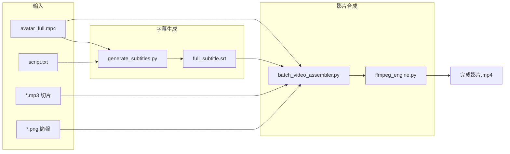
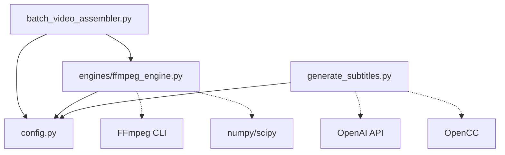

# 🧑‍💻 AutoVideoMaker 程式碼架構指南

> 專為工程師設計的快速上手文件

## 專案結構

```
AutoVideoMaker/
├── batch_video_assembler.py   # 🎬 影片合成入口 (CLI)
├── generate_subtitles.py      # 🎙️ 字幕生成主程式
├── config.py                  # ⚙️ 共用設定參數
└── engines/
    ├── __init__.py
    └── ffmpeg_engine.py       # 🔧 FFmpeg 核心引擎
```

---

## 模組職責

| 檔案 | 職責 | 關鍵依賴 |
|:---|:---|:---|
| `generate_subtitles.py` | Whisper 語音辨識 → DTW 對齊 → GPT 斷句 → SRT 輸出 | OpenAI API, OpenCC |
| `batch_video_assembler.py` | CLI 入口，路徑驗證，呼叫 ffmpeg_engine | config, engines |
| `config.py` | 影片規格、字幕樣式、Avatar 位置等共用常數 | - |
| `engines/ffmpeg_engine.py` | 音訊對齊、平行渲染、最終合成 | numpy, scipy, FFmpeg |

---

## 資料流程圖



---

## 核心函數速查

### `generate_subtitles.py`

```python
step1_transcribe_whisper(audio_path)     # Whisper API 取得字級時間戳
step2_force_alignment(whisper_ts, script) # DTW 對齊修正錯字
step3_segment_text(transcript, client)    # GPT-4o-mini 智慧斷句
step4_align_timestamps(lines, chars)      # 組合時間軸 → SRT
```

### `engines/ffmpeg_engine.py`

```python
find_audio_offset(main, segment, sr)      # FFT 音訊指紋定位
create_segment_videos(pairs, temp, dur)   # 平行渲染片段 (8 threads)
concat_segments(segments, output)         # 串接片段
create_avatar_overlay_video(avatar, dur)  # 圓形遮罩 Avatar
composite_final_video(base, avatar, ...)  # 最終合成
run(folder_path, output_path)             # 引擎入口
```

### `config.py` 設定類別

```python
VideoConfig       # WIDTH=1920, HEIGHT=1080, FPS=24
SubtitleConfig    # FONT_SIZE=96, COLOR="yellow"
AvatarConfig      # CROP_X/Y, SCALE_RATIO=0.12
ProcessingConfig  # MAX_WORKERS=8
FileNames         # SUBTITLE_FILE, AVATAR_FILE...
OutputConfig      # OUTPUT_DIR = ~/Desktop
```

---

## 關鍵技術實作

### 1. Force Alignment (DTW)
**位置**: `generate_subtitles.py` → `step2_force_alignment()`

將 Whisper 辨識結果與正確逐字稿對齊，修正錯字同時保留精確時間戳。

### 2. 音訊指紋對齊 (FFT Cross-Correlation)
**位置**: `ffmpeg_engine.py` → `find_audio_offset()`

用 FFT 找出每個 MP3 切片在總音軌中的精確位置，避免時間累積誤差。

### 3. 幀級精確計算
**位置**: `ffmpeg_engine.py` → `create_segment_videos()`

所有時間轉換為幀數計算，確保 `Σ(片段幀數) == 總影片幀數`。

### 4. 平行渲染
**位置**: `ffmpeg_engine.py` → `create_segment_videos()`

使用 `ThreadPoolExecutor(max_workers=8)` 同時渲染多個片段。

---

## 快速開始

```bash
# 1. 生成字幕
python generate_subtitles.py

# 2. 合成影片
python batch_video_assembler.py /path/to/素材資料夾
```

### 素材資料夾結構

```
素材資料夾/
├── avatar_full.mp4    # 必須：主播影片 (音訊來源)
├── script.txt         # 字幕生成用：逐字稿
├── 1.mp3, 2.mp3...    # 切片語音
├── 1.png, 2.png...    # 對應簡報圖片
└── full_subtitle.srt  # 生成的字幕檔
```

---

## 依賴關係


