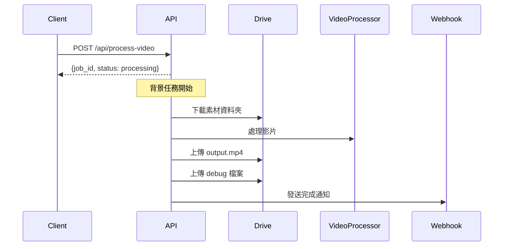
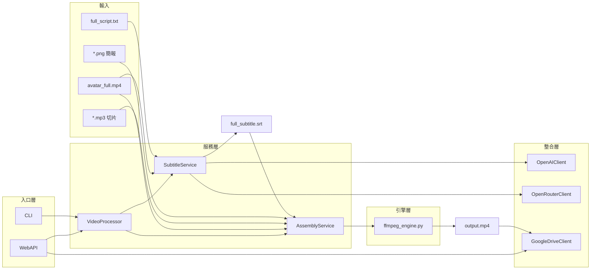
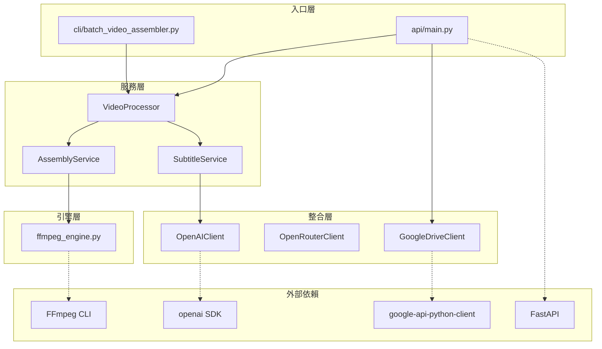

# 🧑‍💻 AutoVideoMaker 程式碼架構指南

> 專為工程師設計的快速上手文件

## 專案結構

```
AutoVideoMaker/
├── api/                       # 🌐 WebAPI 層
│   ├── main.py                    # FastAPI 入口
│   ├── routes.py                  # API 路由與背景任務
│   └── schemas.py                 # Pydantic 請求/回應模型
│
├── cli/                       # 🖥️ CLI 入口層
│   ├── batch_video_assembler.py   # 影片合成 CLI
│   └── generate_subtitles.py      # 字幕生成 CLI
│
├── services/                  # ⚙️ 業務邏輯層
│   ├── video_processor.py         # 統一處理入口（API/CLI 共用）
│   ├── subtitle_service.py        # 字幕生成服務
│   └── assembly_service.py        # 影片合成服務
│
├── engines/                   # 🔧 底層引擎
│   └── ffmpeg_engine.py           # FFmpeg 核心渲染引擎
│
├── integrations/              # 🔌 外部服務整合
│   ├── openai_client.py           # OpenAI API（Whisper/GPT）
│   └── openrouter_client.py       # OpenRouter API (Claude)
│   └── google_drive.py            # Google Drive API
│
├── config.py                  # 📋 共用設定參數
└── service_account.json       # 🔑 Google 認證金鑰
```

---

## 架構設計理念

```mermaid
graph TB
    subgraph "入口層 (API / CLI)"
        API[api/main.py]
        CLI_A[cli/batch_video_assembler.py]
        CLI_B[cli/generate_subtitles.py]
    end
    
    subgraph "服務層 (Business Logic)"
        VP[VideoProcessor]
        SS[SubtitleService<br/>(含標點跳過演算法)]
        AS[AssemblyService]
    end
    
    subgraph "引擎層 (Core Engine)"
        ENG[ffmpeg_engine.py]
    end
    
    subgraph "整合層 (Integrations)"
        OPENAI[OpenAIClient]
        OPENROUTER[OpenRouterClient<br/>(Claude 3.5 Sonnet)]
        GDRIVE[GoogleDriveClient]
    end
    
    API --> VP
    API --> GDRIVE
    CLI_A --> VP
    CLI_B --> SS
    VP --> SS
    VP --> AS
    AS --> ENG
    SS --> OPENAI
    SS --> OPENROUTER
```

---

## 模組職責

| 層級 | 模組 | 職責 |
|:---|:---|:---|
| **API** | `api/main.py` | FastAPI 入口，CORS 設定 |
| **API** | `api/routes.py` | 路由定義，背景任務，Webhook |
| **API** | `api/schemas.py` | Pydantic 模型（VideoRequest, VideoResponse） |
| **CLI** | `cli/batch_video_assembler.py` | 影片合成 CLI 入口 |
| **CLI** | `cli/generate_subtitles.py` | 字幕生成 CLI 入口 |
| **服務** | `services/video_processor.py` | 統一入口：串接字幕生成 + 影片合成 |
| **服務** | `services/subtitle_service.py` | Whisper → 清洗 → 對齊(抗干擾) → Sonnet 4.5 斷句 → SRT |
| **服務** | `services/assembly_service.py` | 素材驗證，呼叫 ffmpeg_engine 合成 |
| **引擎** | `engines/ffmpeg_engine.py` | 音訊對齊、平行渲染、Avatar 遮罩 |
| **整合** | `integrations/openai_client.py` | OpenAI API（Whisper）封裝 |
| **整合** | `integrations/openrouter_client.py` | OpenRouter API（Claude 3.5 Sonnet）封裝 |
| **整合** | `integrations/google_drive.py` | Google Drive 下載/上傳功能 |
| **設定** | `config.py` | 影片規格、字幕樣式、Avatar 位置 |

---

## 核心類別速查

### `api/routes.py`

```python
# API 端點
@router.get("/health")              # 健康檢查
@router.post("/process-video")      # Google Drive 處理
@router.post("/process-local")      # 本地處理（測試用）
@router.get("/jobs/{job_id}")       # 任務狀態查詢

# 背景任務
async def process_video_task(...)   # Drive 處理流程
async def process_local_task(...)   # 本地處理流程
async def send_webhook(...)         # Webhook 通知
```

### `services/video_processor.py`

```python
class VideoProcessor:
    def process(folder_path, output_path, skip_subtitle, debug)
    def generate_subtitle_only(folder_path, debug)
    def assemble_video_only(folder_path, output_path)
    def validate(folder_path)
```

### `services/subtitle_service.py`

```python
class SubtitleService:
    def generate(folder_path, debug)           # 主入口
    def _sanitize_script(text)                 # 符號清洗
    def _step1_transcribe_whisper(audio_path)  # Whisper API
    def _step2_force_alignment(whisper_ts, script)
    def _step3_segment_text(transcript)        # Claude 斷句
    def _step4_align_timestamps(lines, chars)
```

### `integrations/google_drive.py`

```python
class GoogleDriveClient:
    def list_files(folder_id)                  # 列出檔案
    def download_folder(folder_id, local_path) # 下載資料夾
    def upload_file(file_path, parent_id)      # 上傳檔案
    def get_file_link(file_id)                 # 取得連結

def get_drive_client() -> GoogleDriveClient
```

### `integrations/openai_client.py`

```python
class OpenAIClient:
    def transcribe_audio(audio_path, language)
    def chat_completion(system_prompt, user_prompt)

def get_openai_client() -> OpenAIClient
```

### `integrations/openrouter_client.py`

```python
class OpenRouterClient:
    def chat_completion(system_prompt, user_prompt)

def get_openrouter_client() -> OpenRouterClient
```

---

## API 處理流程



---

## 資料流程圖



---

## 快速開始

### WebAPI 模式

```bash
# 啟動伺服器
uvicorn api.main:app --reload --port 8000

# 開啟 Swagger UI
open http://localhost:8000/docs
```

### CLI 模式

```bash
# 完整流程
python -m cli.batch_video_assembler /path/to/素材

# 僅生成字幕
python -m cli.batch_video_assembler /path/to/素材 --subtitle-only

# 僅合成影片
python -m cli.batch_video_assembler /path/to/素材 --video-only
```

---

## 素材資料夾結構

```
素材資料夾/
├── avatar_full.mp4        # 必須：主播影片 (音訊來源)
├── full_script.txt        # 字幕生成用：逐字稿
├── 1.mp3, 2.mp3...        # 切片語音
├── 1.png, 2.png...        # 對應簡報圖片
└── full_subtitle.srt      # 生成的字幕檔
```

---

## 依賴關係


