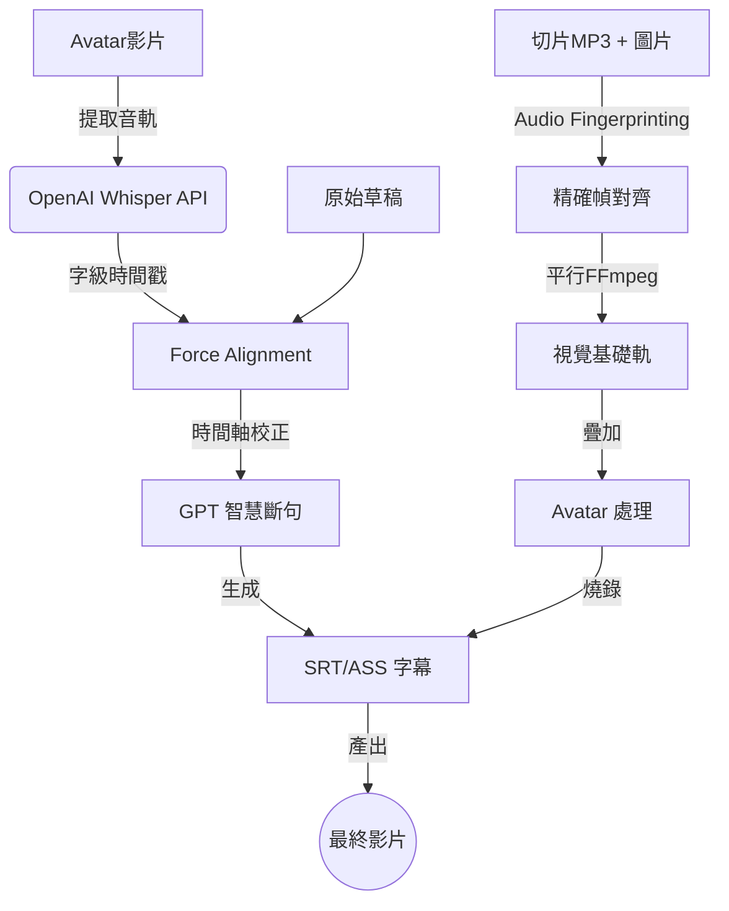

# 自動化簡報影片合成工具 (AutoVideoMaker) V10

這是一個高性能自動化工具，旨在將 **語音檔 (MP3)** 與 **簡報圖片 (JPG/PNG)** 結合成專業 1080p 影片。本版本專注於 **穩定性 (不再搶拍)** 與 **高性能 (轉錄與合成提速 5-10 倍)**。

## 🚀 重點更新 (V10)

1.  **OpenAI Whisper API 集成**：轉錄速度提升至秒級（原本 local 需 30min+）。
2.  **FFmpeg 平行渲染引擎**：利用多核心 CPU 同時生成簡報片段，合成速度提升 400%。
3.  **音訊指紋與幀精確對齊 (Frame-Perfect Sync)**：
    *   使用 FFT Cross-Correlation 技術自動校準 Slide 與總音軌的對位。
    *   採用「幀級長度計算」徹底消除影音不同步（搶拍）問題。
4.  **CLI 非交互模式**：支援指令參數，適合自動化流程。
5.  **ASS 字幕轉錄**：使用 SSA/ASS 格式提供比 SRT 更精確的字幕定位與渲染。

## 💎 功能特色

*   **完美拼接**：自動掃描並對齊 MP3 與圖片，保證聲音與畫面轉換點分秒不差。
*   **圓形 Avatar**：自動裁切 HeyGen 影片人頭並套用圓形遮罩與縮放定位。
*   **AI 智控字幕**：
    *   從 Avatar 原始音軌提取聲音（唯一事實來源）。
    *   GPT 智慧斷句（自動分行，每行 ≤18 字）。
    *   Force Alignment 技術保證字幕與發音高度重合。

## 🛠️ 環境需求

*   Python 3.12
*   FFmpeg (必備，包含 ffprobe)
*   OpenAI API Key (需具備存取存取權)
*   macOS (推薦) 或 Linux

## 📦 安裝

```bash
# 建立虛擬環境
python3 -m venv venv
source venv/bin/activate

# 安裝依賴 (已精簡，移除本地模型依賴)
pip install numpy opencc-python-reimplemented openai python-dotenv
```

## 📖 使用流程

### Step 1：準備素材

將素材放入資料夾，格式如下：
```
素材資料夾/
├── 1.jpg               # 簡報圖片 (1-N)
├── 1.mp3               # 片段語音 (1-N)
├── avatar_full.mp4     # HeyGen 產出的解說影片
└── full_script.txt     # 正確的逐字稿
```

### Step 2：極速生成字幕 (OpenAI API)

```bash
python generate_subtitles.py
# 或在提示時輸入路徑
```

### Step 3：高性能影片合成

```bash
# 模式 A：互動模式
python batch_video_assembler.py

# 模式 B：指令模式 (CLI Mode) - 推薦
python batch_video_assembler.py /路徑/到/素材 --engine ffmpeg
```

輸出：`~/Desktop/{資料夾名稱}.mp4`

## ⚙️ 核心配置 (`config.py`)

您可以在 `config.py` 中調整所有參數，無需修改主程式：

-   **影像屬性**: 解析度 (1080p), FPS (24), 編碼器 (libx264)
-   **字幕樣式**: 字體、顏色 (Yellow), Y 軸中心點 (1000)
-   **Avatar 定位**: 裁切座標、圓形縮放比例
-   **性能設定**: `MAX_WORKERS` 平行線程數 (預設 8)

## 🏗️ 技術架構


