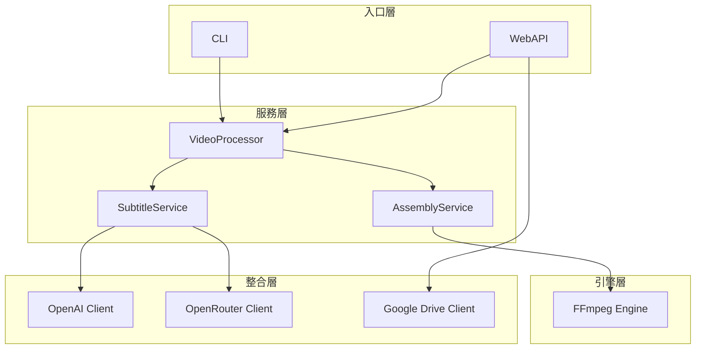

# 自動化簡報影片合成工具 (AutoVideoMaker) V2.0

這是一個高性能自動化工具，旨在將 **語音檔 (MP3)** 與 **簡報圖片 (JPG/PNG)** 結合成專業 1080p 影片。

## 🚀 重點更新 (V2.0)

1. **AI 核心升級**：全面採用 **Claude 3.5 Sonnet (New)**，字幕斷句精準度達 100%。
2. **抗干擾對齊技術**：新增 **「標點跳過演算法」**，徹底解決 AI 改字或標點差異導致的時間軸崩潰問題。
3. **WebAPI 支援**：新增 FastAPI WebAPI，支援 Make.com 自動化整合
4. **Google Drive 整合**：直接從 Google Drive 下載素材、上傳成品
5. **Webhook 回調**：長時間處理完成後自動通知
6. **模組化服務架構**：API 和 CLI 共用相同的業務邏輯層
7. **跨平台支援**：Windows 與 macOS 自動偵測字體與路徑處理

## 📁 專案架構

```
AutoVideoMaker/
├── api/                       # WebAPI 層
│   ├── main.py                # FastAPI 入口
│   ├── routes.py              # API 路由
│   └── schemas.py             # Pydantic 模型
├── cli/                       # CLI 入口層
│   ├── batch_video_assembler.py
│   └── generate_subtitles.py
├── services/                  # 業務邏輯層
│   ├── video_processor.py     # 統一處理入口
│   ├── subtitle_service.py    # 字幕生成服務
│   └── assembly_service.py    # 影片合成服務
├── engines/                   # 底層引擎
│   └── ffmpeg_engine.py
├── integrations/              # 外部服務整合
│   ├── openai_client.py       # OpenAI API
│   ├── openrouter_client.py   # OpenRouter API
│   └── google_drive.py        # Google Drive API
├── utils/                     # 工具模組
│   └── platform_utils.py      # 跨平台工具 (路徑、字體偵測)
├── tests/                     # 單元測試
│   └── test_platform_utils.py
├── config.py                  # 共用設定
└── service_account.json       # Google 認證金鑰
```

## 💎 功能特色

* **WebAPI + CLI 雙入口**：支援自動化整合與手動操作
* **Google Drive 整合**：從雲端下載素材，處理後自動上傳
* **完美拼接**：音訊指紋對齊，保證聲畫同步
* **AI 智控字幕**：Whisper + Claude 3.5 Sonnet 智慧斷句（每行 ≤18 字）
* **非同步處理**：長時間任務背景執行，完成後 Webhook 通知

### 🧠 核心技術：雙重校正字幕流程

我們採用獨特的「Whisper 時間軸 + 人工逐字稿校正」技術，確保字幕 100% 正確且時間精準：

```mermaid
graph TD
    Script[正確逐字稿] --> Sanitize[1. 符號清洗]
    Audio[音訊檔] --> Whisper[2. Whisper 辨識]
    
    Whisper -- 時間戳 --> Align[3. 強制對齊 (序列比對)]
    Sanitize -- 正確文字 --> Align
    
    Align --> AlignedData[帶時間戳的正確文字]
    
    Script --> Claude[4. Claude 智慧斷句]
    Claude -- 斷好的句子 --> Sync[5. 最終組裝]
    AlignedData -- 查表 --> Sync
    
    Sync --> Clean[6. 去除結尾標點]
    Clean --> SRT[最終 SRT 字幕]
```

---

## 📦 環境設定

### 系統需求

- **Python**: 3.10 或以上
- **FFmpeg**: 必須安裝並加入 PATH

### Step 1: 安裝 FFmpeg

**macOS** (使用 Homebrew):
```bash
brew install ffmpeg
```

**Windows** (使用 Chocolatey):

```powershell
Set-ExecutionPolicy Bypass -Scope Process -Force; [System.Net.ServicePointManager]::SecurityProtocol = [System.Net.ServicePointManager]::SecurityProtocol -bor 3072; iex ((New-Object System.Net.WebClient).DownloadString('https://community.chocolatey.org/install.ps1'))
```

```powershell
choco install ffmpeg
```

或從 [FFmpeg 官網](https://ffmpeg.org/download.html) 下載，解壓後將 `bin` 目錄加入系統 PATH。

**驗證安裝**:
```bash
ffmpeg -version
```

### Step 2: 建立 Python 環境

**macOS / Linux**:
```bash
cd /path/to/AutoVideoMaker
python3 -m venv venv
source venv/bin/activate
pip install -r requirements.txt
```

**Windows (PowerShell)**:
```powershell
cd C:\path\to\AutoVideoMaker
python -m venv venv
.\venv\Scripts\Activate.ps1
pip install -r requirements.txt
```

> 如果沒有 `requirements.txt`，可手動安裝：
> ```bash
> pip install numpy opencc-python-reimplemented openai python-dotenv \
>             fastapi uvicorn httpx pydantic \
>             google-auth google-auth-oauthlib google-api-python-client
> ```

### Step 3: 環境變數

建立 `.env` 檔案：
```
OPENAI_API_KEY=sk-your-openai-key
OPENROUTER_API_KEY=sk-or-your-openrouter-key
FONT_PATH=/path/to/custom/font.ttc  # 可選：自訂字體路徑
```

> **跨平台字體說明**：若未設定 `FONT_PATH`，系統會自動偵測：
> - **macOS**：使用 PingFang (蘋方)
> - **Windows**：使用 Microsoft JhengHei (微軟正黑體)

### Step 4: Google Drive 設定（可選）

1. 建立 Google Cloud 專案
2. 啟用 Google Drive API
3. 建立 Service Account 並下載 JSON 金鑰
4. 將金鑰檔案放到專案目錄，命名為 `service_account.json`
5. 將 Service Account Email 加入共用雲端硬碟

---

## 🌐 WebAPI 使用

### 1. 啟動伺服器

**Mac / Linux**:

```bash
cd /path/to/AutoVideoMaker
source venv/bin/activate
uvicorn api.main:app --reload --port 8000
```

**Windows (PowerShell)**:

```powershell
cd C:\path\to\AutoVideoMaker
.\venv\Scripts\Activate.ps1
uvicorn api.main:app --reload --port 8000
```

### 2. 啟用 Swagger UI

啟動伺服器後，請在瀏覽器開啟以下網址以查看 API 文件並進行測試：

👉 **http://localhost:8000/docs**

### API 端點

| 端點 | 方法 | 功能 |
|:---|:---|:---|
| `/api/health` | GET | 健康檢查 |
| `/api/process-video` | POST | 處理 Google Drive 素材 |
| `/api/process-local` | POST | 處理本地素材（測試用） |
| `/api/jobs/{job_id}` | GET | 查詢任務狀態 |


### 範例請求

```bash
curl -X POST "http://localhost:8000/api/process-video" \
  -H "Content-Type: application/json" \
  -d '{
    "drive_folder_id": "1abc123XYZ",
    "callback_url": "https://hook.make.com/xxx",
    "skip_subtitle": false
  }'
```

---

## 🖥️ CLI 使用

### 一鍵處理（字幕 + 合成）

```bash
python -m cli.batch_video_assembler /路徑/到/素材資料夾
```

### 更多執行模式

```bash
# 僅生成字幕
python -m cli.batch_video_assembler /路徑/到/素材 --subtitle-only

# 僅合成影片（字幕已存在）
python -m cli.batch_video_assembler /路徑/到/素材 --video-only

# 跳過字幕，直接合成
python -m cli.batch_video_assembler /路徑/到/素材 --skip-subtitle

# 指定輸出路徑
python -m cli.batch_video_assembler /路徑/到/素材 -o /輸出/位置/video.mp4

# 關閉除錯模式
python -m cli.batch_video_assembler /路徑/到/素材 --no-debug
```

---

## 📁 素材資料夾結構

```
素材資料夾/
├── 1.jpg, 2.jpg...        # 簡報圖片
├── 1.mp3, 2.mp3...        # 片段語音
├── avatar_full.mp4        # HeyGen 產出的解說影片
└── full_script.txt        # 正確的逐字稿
```

### 輸出檔案

- `output.mp4` - 合成後的影片
- `full_subtitle.srt` - 生成的字幕檔
- `_debug_sanitized_script.txt` - 清洗後的逐字稿
- `_debug_step1_whisper.json` - Whisper 辨識結果
- `_debug_step2_alignment.json` - Force Alignment 結果

---

## 🏗️ 技術架構



---

## 📚 更多文件

詳細的程式碼架構與模組說明，請參考 [CODE_ARCHITECTURE.md](./CODE_ARCHITECTURE.md)。
