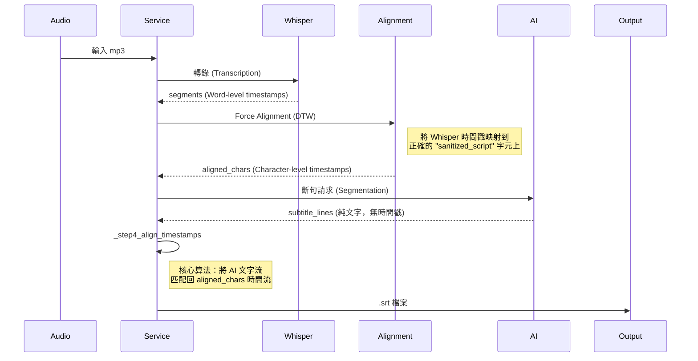

# 🌊 資料流與關鍵變數 (`DATA_FLOW.md`)

此文件說明資料如何在系統中流動，以及關鍵資料結構的定義。

## 1. 字幕生成流程 (Subtitle Generation Flow)

這是最複雜的資料流，涉及多個轉換步驟。



## 2. 關鍵資料結構

### `aligned_chars` (List[Dict])
由 `_step2_force_alignment` 產出，是時間戳的**唯一真理來源**。
```json
[
  {
    "char": "這",
    "start": 0.05,
    "end": 0.25,
    "score": 0.98  // 信心分數
  },
  {
    "char": "個",
    "start": 0.25,
    "end": 0.40,
    "score": 0.99
  }
]
```

### `subtitle_lines` (List[str])
由 `_step3_segment_text` (AI) 產出。
- **特性**：僅包含文字，內容**必須**與 `sanitized_script` 順序一致。
- **潛在風險**：AI 可能增加標點或空格，需透過 `skip_chars` 機制處理。

## 3. 中間產物 (Debug Artifacts)

每次執行都會產生以下檔案以供除錯：

| 檔案名稱 | 來源 | 用途 |
|---|---|---|
| `_debug_sanitized_script.txt` | 原始逐字稿清洗後 | 用於檢查清洗邏輯是否誤刪內容 |
| `_debug_step1_whisper.json` | Whisper API | 檢查原始語音辨識的最早來源數據 |
| `_debug_step2_alignment.json` | Force Alignment | **最重要的除錯檔**，確認字元時間戳是否正確 |
| `_debug_step3_ai_segments.txt` | Claude Sonnet | 檢查 AI 的斷句邏輯是否合理 |
